# Documentazione Test Embedded
**Installazione**

In questa sezione andremo a vedere quali sono i tool utilizzati per poter usare questa semplice applicazione

**Visual Studio Code**

Visual Studio Code è un editor di codice sorgente progettato per essere leggero, veloce e altamente personalizzabile, offrendo agli sviluppatori un'ampia gamma di funzionalità per scrivere, modificare e debuggare codice in diversi linguaggi di programmazione.
Dal seguente link si può installare l’editor: https://code.visualstudio.com/download
Affinché si possa utilizzare l’editor, bisogna realizzare una cartella in cui salvare tutto il lavoro e poi andare nella sezione “Estensioni” e installare: “JavaScript and TypeScript Nightly”  e “Docker”

**Node.js**

Node.js è un ambiente di runtime open source per eseguire codice JavaScript lato server che consente agli sviluppatori di creare applicazioni di rete scalabili e veloci. Una delle caratteristiche chiave di Node.js è il suo modello di I/O asincrono non bloccante, che consente di gestire numerose richieste simultaneamente senza dover attendere che una richiesta si completi prima di gestire la successiva
Dal seguente link si può installare l’ambiente: https://nodejs.org/en
All’interno di Node.js è incluso anche npm ("Node Package Manager"), utilizzato per installare, condividere e gestire le dipendenze dei progetti JavaScript, facilitando la gestione dei pacchetti e delle dipendenze, oltre a fornire un'infrastruttura per la condivisione del codice e l'automazione dei flussi di lavoro.

Per questo progetto, è necessario includere la cartella "node_modules" che contiene le dipendenze del progetto. È possibile fare ciò all'interno della directory di dove sarà il progetto ed eseguire, dal prompt dei comandi, il comando "npm install".

**TypeScript**

TypeScript è un linguaggio di programmazione che consente agli sviluppatori di definire chiaramente i tipi di variabili, parametri di funzione e valori di ritorno delle funzioni, permettendo di aggiunge un livello di robustezza al codice, aiutando a individuare errori durante lo sviluppo migliorandone la manutenibilità del codice.
Usando il seguente comando sul prompt dei comandi “npm install -g typescript” si può installare il linguaggio. 

**Electron**

Electron è un framework open-source che consente agli sviluppatori di creare applicazioni desktop multi-piattaforma utilizzando tecnologie web come HTML, CSS e JavaScript. Si basa su diversi aspetti: basato su Chromium e Node.js, applicazioni desktop cross-platform e utilizzo delle tecnologie web.
Usando il seguente comando sul prompt dei comandi per l’installazione “npm install -g electron”

**Serial Port**

SerialPort è una libreria Node.js open-source che fornisce un'API per comunicare con porte seriali su dispositivi. È utilizzata principalmente per interagire con dispositivi hardware che supportano la comunicazione tramite porte seriali fornendo un'interfaccia semplice e potente.
Usando il seguente comando sul prompt dei comandi per l’installazione “npm install serialport”

**Git**

Git è un sistema di controllo versione distribuito, utilizzato principalmente per il tracking delle modifiche nel codice sorgente durante lo sviluppo software. Possiede diverse caratteristiche tra le quali: Controllo di versione distribuito, Branching e merging, Velocità ed efficienza, Integrità dei dati e Collaborazione tra sviluppatori.
Dal seguente link si può procedere all’installazione: https://www.git-scm.com/downloads 
Dopo aver effettuato il fork su GitHub, usando GitBash eseguiamo il suddetto comando: “git clone https://github.com/tuo-username/nome-del-repository-forkato.git”. 
Successivamente bisogna spostare l’intera cartella tramite il seguente comando “cp -r /percorso-dove-si-trova-la-catella-con-il-progetto .” ( o anche con il semplice copia e incolla), entrare nel repository clonato con il comando “cd nome-del-repository-clonato” e aggiungervi i file con il comando “ git add .”. Effettuare un commit tramite il comando “git commit -m "messaggio che si vuole scrivere per descrivere l’azione"” ed infine inviare le modifiche su GitHub tramite il comando “git push origin main”.
Se l’azione “git commit -m "messaggio che si vuole scrivere per descrivere l’azione"” dovesse dare problemi di tipo “Author identity unknown”, eseguire questi due comandi per configurare l’identità:
“git config --global user.name "tuo_nome"”
“git config --global user.email "tuo_email@example.com"”

**Spiegazione Codice**

Prima di entrare nel dettaglio dei file utilizzati per il funzionamento di questa applicazione, è importante fare una premessa:
Dal prompt dei comandi bisogna entrare nella directory del progetto con il comando “cd C:\X\X\X\nome_cartella”, eseguire il comando “npm init -y” per generare il file “package.json” con le configurazioni di base ed eseguire il comando “npx tsc –init” per generare il file “tsconfig.json” con la configurazione del comportamento del compilatore.
Entriamo nel dettaglio del codice:

**File main.js**

In questo codice è presente un’applicazione Electron che interagisce con una porta seriale per comunicare con un dispositivo hardware e mostra l'interazione tramite una finestra di browser.

*Importazione dei moduli e definizione della finestra principale*

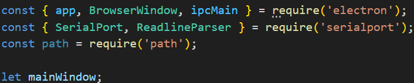

Vengono importati i moduli necessari da Electron (app, BrowserWindow, ipcMain) e dalla libreria serialport (SerialPort, ReadlineParser).

path è un modulo Node.js per gestire i percorsi dei file.

mainWindow è la variabile che conterrà l'istanza della finestra principale dell'applicazione.

*Creazione della finestra principale*

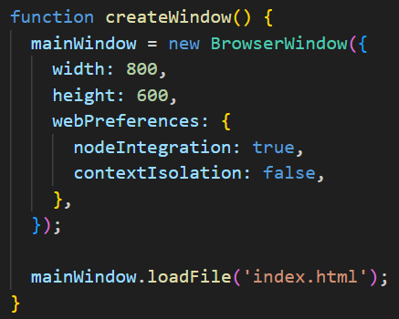

Questa funzione crea una nuova finestra BrowserWindow con dimensioni specificate e opzioni di configurazione per i webPreferences.

nodeIntegration: true abilita l'integrazione diretta di Node.js nel processo di rendering della pagina web.

contextIsolation: false disabilita l'isolamento del contesto, consentendo l'accesso diretto agli oggetti di Electron dal codice JavaScript eseguito nella pagina web caricata.

mainWindow.loadFile('index.html') carica il file index.html nella finestra principale.

*Eventi di Electron*

*Evento di Creazione*

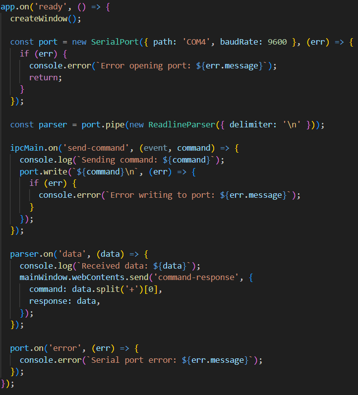

Questo evento si attiva quando Electron ha completato l'inizializzazione e l'app è pronta per creare la finestra principale e avviare altre operazioni.

Nello specifico abbiamo:

*Interazione con la porta seriale*

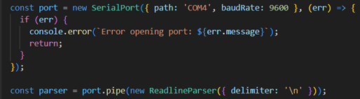

Viene creato un oggetto SerialPort per comunicare con la porta seriale specificata (COM4 a baudRate di 9600). Eventuali errori nell'apertura della porta vengono gestiti e stampati sulla console.

ReadlineParser viene utilizzato per leggere i dati dalla porta seriale line-by-line

*Gestione degli eventi IPC (Inter-Process Communication)*

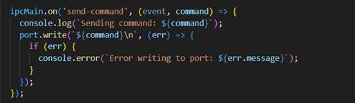

Questo blocco gestisce l'evento 'send-command' proveniente dalla finestra renderizzata (index.html) tramite IPC.

Quando riceve un comando, lo stampa sulla console e lo scrive sulla porta seriale. Eventuali errori di scrittura vengono gestiti e stampati.

*Gestione dei dati ricevuti dalla porta seriale*

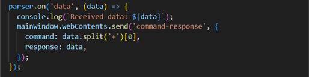

Quando dati vengono ricevuti dalla porta seriale tramite il parser, vengono stampati sulla console. Poi, i dati vengono inviati alla finestra principale tramite "mainWindow.webContents.send", con l'evento 'command-response'. Questo meccanismo consente alla finestra di visualizzare e gestire la risposta ricevuta dalla porta seriale.

*Gestione degli errori sulla porta seriale*

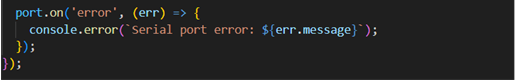

Questo blocco gestisce gli errori che possono verificarsi sulla porta seriale, stampando i messaggi di errore sulla console.

*Evento di Chiusura*

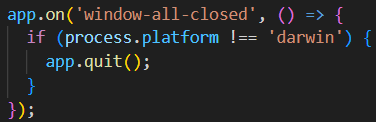

Questo evento gestisce la chiusura di tutte le finestre dell'applicazione. 

*Evento di attivazione*

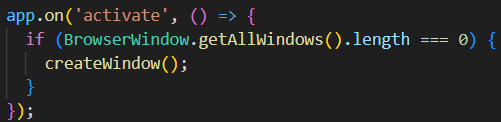

Questo evento si attiva quando l'app viene riattivata e non ci sono altre finestre aperte. In questo caso, viene creata una nuova finestra.

**File index.html**
Questo file definisce una semplice pagina web che mostra quattro cerchi rossi disposti in una griglia. Ogni cerchio è cliccabile e la pagina include un file JavaScript esterno chiamato renderer.js per gestire l'interazione con gli elementi della pagina.

*DOCTYPE e Intestazione HTML*

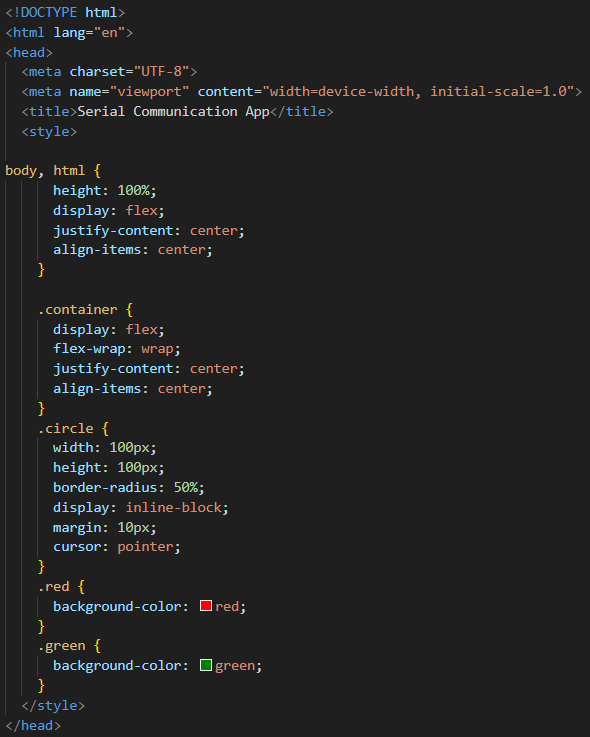

<!DOCTYPE html> specifica che il documento è un documento HTML5.

<html lang="en"> specifica che il documento è in lingua inglese.

<head> contiene le informazioni meta (codifica, viewport, titolo) e i CSS inline.

Al suo interno c’è la sezione style

*Sezione style*

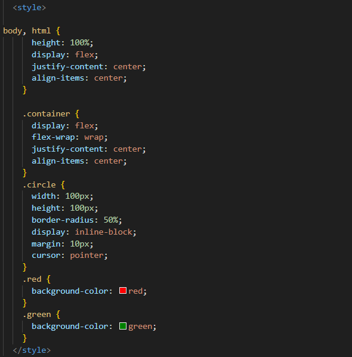

body, html: imposta l'altezza del body e dell'html al 100% della finestra del browser, e li allinea al centro.

.container: definisce un contenitore flessibile per i cerchi.

.circle: definisce uno stile per i cerchi, impostando dimensioni, bordo arrotondato, display inline-block, margine e cursore.

.red e .green: definiscono stili per sfondi rossi e verdi per i cerchi, rispettivamente. Attualmente, tutti i cerchi hanno lo stile .red.

*Body della Pagina*

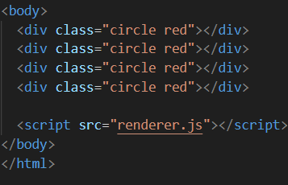

Vengono definiti quattro elementi 
 con la classe circle red, ciascuno rappresentante un cerchio rosso.
Alla fine del body è incluso il tag <script> che importa il file JavaScript esterno renderer.js. Questo file conterrà il codice per gestire l'interazione degli utenti con i cerchi nella pagina.

**File renderer.js**
Questo file viene eseguito all'interno di un processo di rendering in un'applicazione Electron. Esso gestisce l'interazione degli utenti con cerchi cliccabili sulla pagina HTML e comunica con il processo principale di Electron utilizzando IPC (Inter-Process Communication).

*Importazione di ipcRenderer*

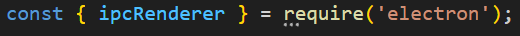

ipcRenderer è un modulo di Electron che permette al processo di rendering di comunicare con il processo principale di Electron utilizzando IPC.

*Evento 'DOMContentLoaded'*

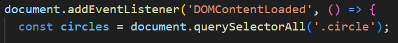

Questo evento si attiva quando il documento HTML è completamente caricato e analizzato, consentendo di interagire con gli elementi della pagina in modo sicuro, dove document.querySelectorAll('.circle') seleziona tutti gli elementi della pagina che hanno la classe CSS circle e li memorizza in una NodeList chiamata circles.

*Iterazione sui cerchi e gestione dei clic*

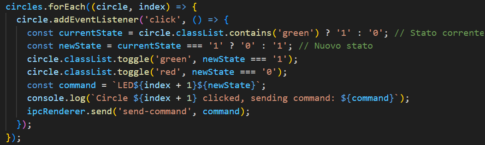

forEach viene utilizzato per iterare su ogni cerchio selezionato.

circle.addEventListener('click', () => { ... }) assegna un gestore di eventi al click su ciascun cerchio.

All’interno troviamo:

.currentState determina lo stato attuale del cerchio in base alla presenza della classe green (1 se è verde, altrimenti 0).

.newState calcola il nuovo stato opposto di quello attuale.

.circle.classList.toggle('green', newState === '1') e circle.classList.toggle('red', newState === '0') aggiornano visivamente il cerchio al nuovo stato.

.command viene formato come una stringa che rappresenta il comando da inviare al processo principale di Electron.

.ipcRenderer.send('send-command', command) invia il comando tramite IPC al processo principale di Electron per la gestione della comunicazione seriale o di altro tipo.

*Gestione della risposta del comando*

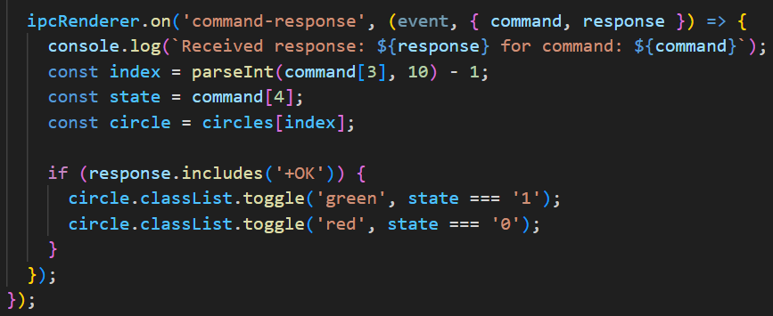

ipcRenderer.on('command-response', ...) ascolta per l'evento 'command-response' inviato dal processo principale di Electron in risposta al comando inviato.

Quando riceve la risposta, gestisce la risposta aggiornando visivamente lo stato dei cerchi in base alla risposta ricevuta.

Al suo interno troviamo un controllo che ci dice che se la risposta contiene '+OK', aggiorna visivamente il cerchio in base allo stato ricevuto (state === '1' per verde, state === '0' per rosso).

**Funzionamento**

Dal prompt dei comandi bisogna entrare nella directory del progetto con il comando “cd C:\X\X\X\nome_cartella” (oppure si può sfruttare il terminale che offre Visual Studio Code cliccando su “Terminal” dove è già impostato nella directory del progetto)
Eseguiamo il comando "npm install” per installare le dipendenze utilizzate.

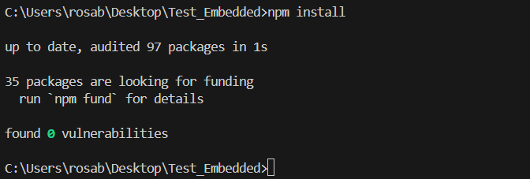

Eseguiamo il comando “npm start” per avviare il tutto

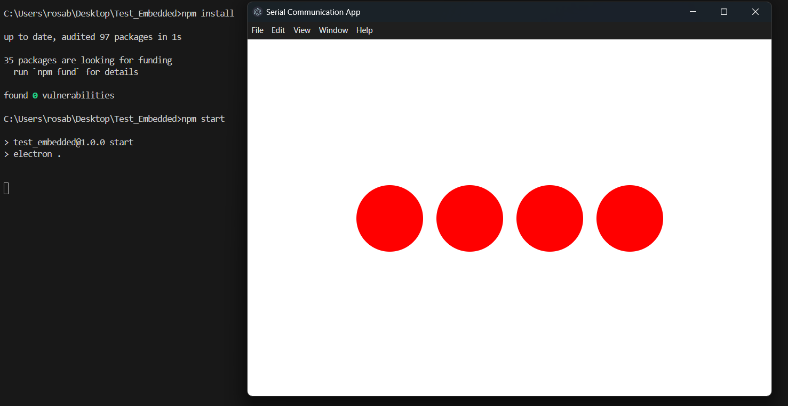

Vediamo come le richieste vengano eseguite e il colore dei cerchi cambi

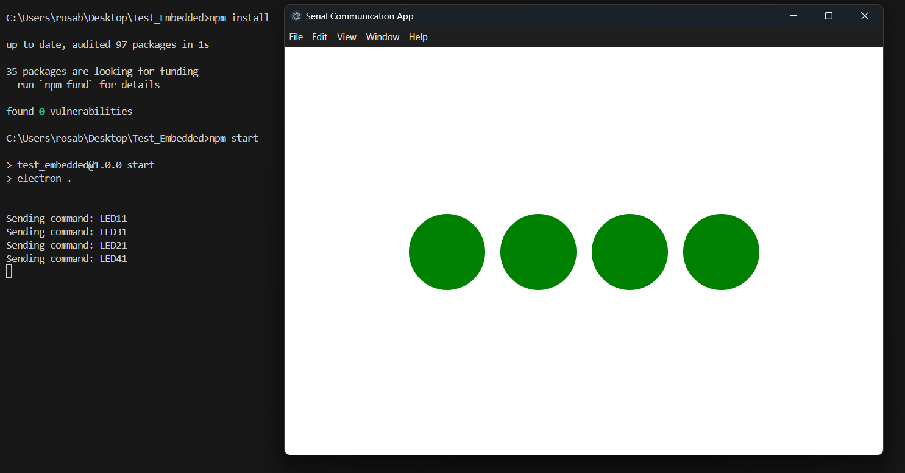

Anche quando vogliamo far diventare rosso i cerchi, le richieste rispondono correttamente:

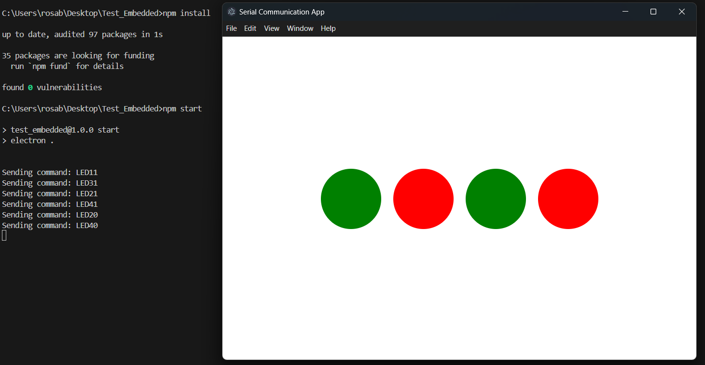

Per uscire, basta semplicemente chiudere la finestra

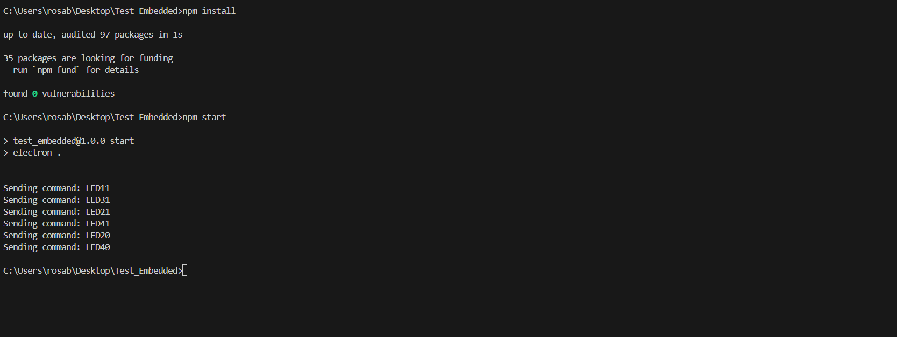

**Realizzazione Eseguibile**

È possibile realizzare un file eseguibile dell’applicazione di cui abbiamo visto precedentemente il suo funzionamento.
Dal prompt dei comandi bisogna entrare nella directory del progetto con il comando “cd C:\X\X\X\nome_cartella” (oppure si può sfruttare il terminale che offre Visual Studio Code cliccando su “Terminal” dove è già impostato nella directory del progetto), installare le dipendenze con il comando “npm install”, installare il pacchetto con il comando "npm install -g electron-packager" ed infine digitare il comando “electron-packager . --platform=win32 --arch=x64” (modificando “—platform” e “—arch” in base alle necessità) per realizzare il file eseguibile che sarà inserito nella directory del progetto.

**Sezione Extra**

È possibile utilizzare, per questa applicazione, anche Docker.

Docker è una piattaforma open source progettata per automatizzare la distribuzione, il test e il deployment delle applicazioni all'interno di container software. Un container è un'unità leggera e portatile che contiene tutto il necessario per eseguire un'applicazione, inclusi il codice, le librerie, le dipendenze e le configurazioni.
Dal seguente link è possibile scaricare l’applicazione: https://www.docker.com/products/docker-desktop/ 

È importante che l’utilizzo di docker dev’essere fatto con una versione di windows 10 o 11 enterprise o pro e bisogna azionare le funzionalità di “Hyper-V” e “Virtual Machine Platform” (aprendo PowerShell come amministratore, eseguire questo comando “dism.exe /online /get-features /format:table” per visualizzare un elenco di tutte le funzionalità che possono essere abilitate.

Per abilitare una funzionalità, eseguire il seguente comando: “dism.exe /online /enable-feature /featurename:nome_funzionalità_d’abilitare /all /norestart” e riavviare il pc per confermare le abilità attivate)

Con Docker è possibile realizzare dei file chiamati “Dockerfile”. 

I Dockerfile sono dei file di configurazione usati da Docker per creare un'immagine Docker. Un'immagine Docker è un pacchetto leggero e autonomo che include tutto il necessario per eseguire un'applicazione: codice, runtime, librerie e impostazioni di configurazione.

